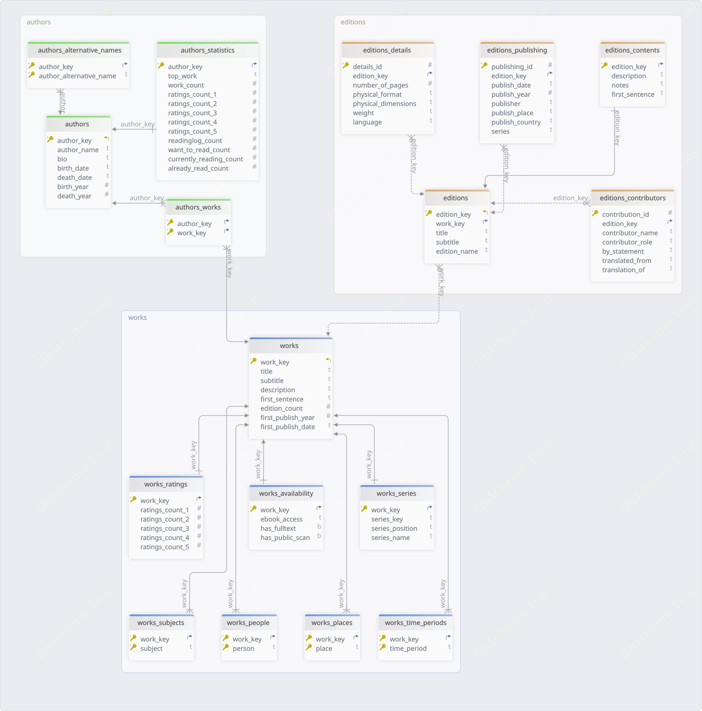

# OpenLibrary ETL Pipeline

An end-to-end data engineering project that ingests book metadata from the Open Library API, transforms and normalizes it into a relational PostgreSQL database, and exposes it through a FastAPI-based REST API featuring search, relationship navigation, and structured response models.

The project implements a production-style ETL workflow with schema-driven transformations, structured data modeling, indexing, testing, structured logging, and performance benchmarking to provide efficient access to authors, works, editions, ratings, and related metadata.

The repository includes a representative dataset for demonstration, testing, and reproducibility.

Open Library metadata is provided by the Internet Archive. This project is an independent work and is not affiliated with, endorsed by, or sponsored by Open Library or the Internet Archive.

---

## Table of Contents

<!-- TOC -->
* [OpenLibrary ETL Pipeline](#openlibrary-etl-pipeline)
  * [Table of Contents](#table-of-contents)
  * [Overview](#overview)
    * [Pipeline Phases](#pipeline-phases)
    * [Project Structure](#project-structure)
  * [Tools](#tools)
    * [Requirements](#requirements)
  * [How to Run](#how-to-run)
  * [Data](#data)
    * [Source](#source)
    * [Output](#output)
    * [Database Schema](#database-schema)
    * [Cardinality](#cardinality)
  * [Logging](#logging)
  * [API Overview](#api-overview)
    * [How to Run](#how-to-run-1)
    * [API Documentation](#api-documentation)
    * [Suggested Usage Flow](#suggested-usage-flow)
    * [Error Handling](#error-handling)
      * [HTTP Status Codes](#http-status-codes)
      * [Error Types](#error-types)
    * [Testing](#testing)
    * [Performance Benchmarking](#performance-benchmarking)
      * [Summary of Results](#summary-of-results)
      * [Key Findings](#key-findings)
<!-- TOC -->

---

## Overview

What the project is trying to achieve:

- Extract structured romance fiction data from OpenLibrary API endpoints
- Build a relational data model for general works, authors, editions and series
- Clean and transform raw JSON into normalized tables
- Load processed data into a PostgreSQL database
- Ensure reproducibility and modular ETL design
- Expose processed data through a REST-style API built with FastAPI

---

### Pipeline Phases

1. `Extract`: fetch data from OpenLibrary API and store raw JSON responses in `data/romance_fiction/raw/`, preserving original structure for reproducibility and reprocessing.

2. `Transform`: normalize nested OpenLibrary JSON into flat relational structures, standardize identifiers and key formats, clean and preprocess text fields (e.g. stripping, handling missing values), resolve and expand multi-value fields, validate primary keys and data integrity rules, and generate structured tables saved in `data/romance_fiction/processed/`.

3. `Load`: initialize PostgreSQL database, create schema and tables from SQL definition files, create indexes, and load processed CSV files into the romance_fiction database while enforcing relational constraints.

> **Note:** See [phases_stages.md](docs/logging/phases_stages.md) for more information on the phases and their respective steps.
---

### Project Structure

    .
    ├── api/
    │   ├── repository/           # Data access layer (DB queries)
    │   │   └── sql/              # SQL query modules organized by entity
    │   │       ├── authors/      # Authors-related queries
    │   │       ├── editions/     # Editions-related queries
    │   │       ├── search/       # Search-related queries
    │   │       └── works/        # Works-related queries
    │   ├── response_builders/    # API responses builders
    │   ├── routers/              # FastAPI route definitions (endpoint controllers)
    │   ├── schemas/              # Pydantic response models
    │   │   └── entities/         # Entity schemas
    │   └── utils/                # Pagination utility functions
    │
    ├── config/                   # OpenLibrary API configuration and project paths
    │  
    ├── data/
    │   └── romance_fiction/
    │       ├── raw/              # Raw OpenLibrary API responses
    │       ├── staging/          # Intermediate files used between ETL stages
    │       └── processed/        # Final normalized tables
    │ 
    ├── database/
    │   ├── indexes/              # SQL index definitions
    │   └── schema/               # SQL table definitions
    │ 
    ├── docs                      # Project documentation
    │   ├───api                   # API documentation (endpoints, usage, examples)
    │   ├───database              # Database-related documentation
    │   │    └───diagrams         # ER diagrams
    │   └───logging               # Logging documentation (event taxonomy, naming conventions, log levels, and examples)
    │ 
    ├── tests/
    │   ├── integration/            # API integration tests
    │   └── performance/            # Database query benchmarking
    │       └── results/            # Benchmark outputs and reports
    │ 
    ├── etl/
    │   ├── extract/              # Data extraction scripts
    │   ├── transform/            # Data transformation scripts
    │   └── load/                 # PostgreSQL database loading scripts
    │ 
    ├── logs/                     # Pipeline execution logs
    │
    ├── open_library/             # Core package for Open Library API access and record management
    │
    ├── utilities/                # Reusable helper functions for ETL operations (I/O, logging, validation, DB, and pipeline utilities)
    │   ├── data/                 # Data batching, parsing, validation and table preparation scripts
    │   └───io/                   # Input/output utilities for handling CSV and JSON data files
    │
    │── extract.py                # Entry point for extraction stage
    │── transform.py              # Entry point for transformation stage
    │── load.py                   # Entry point for loading stage
    └── main.py                   # ETL pipeline entry point (orchestrates extract → transform → load)

---

## Tools
    
This project leverages the following technologies across the ETL and API layers:

- `OpenLibrary API`: external data source for books, authors, editions, and metadata
- `Python`: primary language used for ETL pipeline and backend services
- `Pandas`: data cleaning, transformation, and normalization
- `PostgreSQL`: relational database used for structured storage and querying of processed data
- `FastAPI`: RESTful API framework for exposing structured data
- `Uvicorn`: ASGI server used to run and serve the FastAPI application

---

### Requirements

    fastapi==0.136.3
    uvicorn==0.49.0
    sqlalchemy==2.0.48
    psycopg2==2.9.12
    pandas==3.0.2
    numpy==2.4.4
    requests==2.33.1
    python-dotenv==1.2.2
    pydantic==2.13.4
    langdetect==1.0.9
    python-dateutil==2.9.0.post0
    tzdata==2026.2
    six==1.17.0
    pytest==9.1.1
    httpx2==2.4.0
    pycountry==26.2.16
---

## How to Run

**STEP 1**: Set up database and API settings

Create an `.env` file and add PostgreSQL configuration like in [.env.example](.env.example) with options:
- `DB_HOST`: host where the PostgreSQL database is running
- `DB_USER`: username used to connect to the database
- `DB_PASSWORD`: password for the database user
- `DB_PORT`: port on which PostgreSQL is running
- `DB_NAME`: name of the database to connect to

In the same file Open Library's API settings can be changed with options:
- `GENRE`: the genre for querying general works
- `LIMIT`: how many records to be returned via the `SEARCH` query for each page
- `MAX_PAGES`: the maximum number fo pages to be returned via the `SEARCH` query (i.e. `LIMIT` $\times$ `MAX_PAGES` is the total number of works to be returned)
- `MAX_ATTEMPTS`: maximum number of retries for a query, in case an error arises
- `CONNECT_TIMEOUT`: timeout (in seconds) for establishing a connection to the API
- `READ_TIMEOUT`: timeout (in seconds) for reading a response from the API

**STEP 2**: Run the pipeline

Run this project using only the following command:

    python main.py

---

## Data

### Source

OpenLibrary API was used for data ingestion.
See [entrypoints.md](docs/open_library_api/entrypoints.md) for more information on API endpoints.

> **Note**:
> Open Library uses the LOC maintained ISO 693-2 codes: https://www.loc.gov/standards/iso639-2/php/code_list.php

---

### Output

The processed tables are located at `data/romance_fiction/processed` and loaded in the database with the following sequence:

| Table                         | Rows   | Description                                                                                                                                    |
|-------------------------------|--------|------------------------------------------------------------------------------------------------------------------------------------------------|
| **authors**                   | 501    | Core author records including names, biography, birth/death dates, and lifespan information.                                                   |
| **authors_alternative_names** | 2808   | Alternative names, pseudonyms, aliases, pen names, and name variations associated with authors.                                                |
| **authors_statistics**        | 500    | Aggregated author-level statistics including work counts, ratings distribution, reading activity, and most popular work.                       |
| **works**                     | 2000   | Canonical literary works (abstract titles) containing work-level metadata such as title, description, publication history, and edition counts. |
| **authors_works**             | 2091   | Many-to-many relationship linking authors to the works they created or contributed to.                                                         |
| **works_ratings**             | 2000   | Work-level rating distribution data, including the number of 1-star, 2-star, 3-star, 4-star, and 5-star ratings received by each work.         |
| **works_series**              | 82     | Series membership information for works, including series identifier, series name, and position within the series.                             |
| **works_availability**        | 2000   | Availability and access information for works, including ebook access status, public scans, and full-text availability.                        |
| **works_subjects**            | 14034  | Subject classifications and thematic categories assigned to works.                                                                             |
| **works_people**              | 3844   | People, characters, or notable individuals referenced, discussed, or featured in works.                                                        |
| **works_places**              | 1689   | Geographic locations, settings, or places associated with works.                                                                               |
| **works_time_periods**        | 604    | Historical eras, time periods, or chronological settings associated with works.                                                                |
| **editions**                  | 54589  | Specific published editions of works, including edition titles, subtitles, and edition-specific identifiers.                                   |
| **editions_contributors**     | 11288  | Contributors to editions (e.g., translators, editors, illustrators, foreword writers) and their roles.                                         |
| **editions_publishing**       | 59020  | Publication metadata for editions, including publisher, publication date, publication place, country, and series information.                  |
| **editions_contents**         | 9567   | Edition-specific content information such as descriptions, notes, and opening text.                                                            |
| **editions_details**          | 52656  | Physical and bibliographic details of editions, including page count, format, dimensions, weight, and language.                                |

---

### Database Schema

In the following image the database's diagram is presented, by grouping the 16 tables in 3 groups:



---

### Cardinality

| Relationship                 | Cardinality                    |
|------------------------------|--------------------------------|
| Author ↔ Work                | Many-to-many (`authors_works`) |
| Work ↔ Edition               | One-to-many                    |
| Work ↔ Ratings               | One-to-one                     |
| Work ↔ Subject               | One-to-many                    |
| Work ↔ Person                | One-to-many                    |
| Work ↔ Place                 | One-to-many                    |
| Work ↔ Time Period           | One-to-many                    |
| Work ↔ Availability          | One-to-one                     |
| Work ↔ Series                | Zero-or-one per work           |
| Author ↔ Alternative Names   | One-to-many                    |
| Author ↔ Statistics          | One-to-one                     |
| Edition ↔ Contributors       | One-to-many                    |
| Edition ↔ Publishing Records | One-to-many                    |
| Edition ↔ Contents           | One-to-one                     |
| Edition ↔ Details            | One-to-one                     |

---

## Logging

The pipeline uses structured event-based logging for execution tracking, validation, error reporting and monitoring.

For the complete logging specification, see [events.md](docs/logging/events.md).

---

## API Overview

This project provides a REST-style API built with FastAPI that exposes structured access to works, authors, editions, ratings, availability, and related metadata stored in a relational database derived from Open Library data.

---

### How to Run

**STEP 1**: Navigate to the project's directory

```console
cd your-project-name
```

**STEP 2**: Start the FastAPI server using Uvicorn

```console
uvicorn api.app:app --reload
```

**STEP 3**: Locate the Base URL

Once the server starts, Uvicorn will display output similar to:

```
INFO:   Uvicorn running on {BASE_URL} (Press CTRL+C to quit)
```

`BASE_URL` is your Base URL for accessing the API.

---

### API Documentation

FastAPI provides interactive documentation out of the box.

You can access it via:

- Swagger UI: `{BASE_URL}/docs`
- ReDoc: `{BASE_URL}/redoc`

These interfaces allow you to explore and test all API endpoints directly in the browser.

---

### Suggested Usage Flow

In [examples.md](docs/api/examples.md) a suggested usage flow is presented and some response examples.

---

### Error Handling

The API uses consistent HTTP status codes and structured error identifiers to make failures predictable and machine-readable.

#### HTTP Status Codes

    - 400 Bad Request
    - 404 Not Found
    - 405 Method Not Allowed
    - 422 Unprocessable Content

#### Error Types

Each error response includes a domain-specific identifier:

| Status Code    | Description                                                                         | Error Codes                                                                                                    |
|----------------|-------------------------------------------------------------------------------------|----------------------------------------------------------------------------------------------------------------|
| `400`          | Bad Request - The request is invalid or malformed                                   | `INVALID_INPUT_ERROR`                                                                                          |
| `404`          | Not Found - The requested resource does not exist                                   | `WORK_NOT_FOUND_ERROR`, `AUTHOR_NOT_FOUND_ERROR`, `EDITION_NOT_FOUND_ERROR`                                    |
| `405`          | Method Not Allowed - The HTTP method is not supported for this endpoint             | `LISTING_NOT_SUPPORTED`                                                                                        |
| `422`          | Unprocessable Content - The request is syntactically valid but semantically invalid | `INVALID_WORK_KEY_ERROR`, `INVALID_AUTHOR_KEY_ERROR`, `INVALID_EDITION_KEY_ERROR`, `INVALID_QUERY_COMBINATION` |

---

### Testing

This project uses `pytest` to test FastAPI API endpoints.

Tests are focused on validating request/response behavior, endpoint correctness, and error handling using FastAPI’s `TestClient` without requiring a running server.

To run all tests in the terminal run:

    pytest


---

### Performance Benchmarking

To evaluate the impact of database indexing on query performance, execution times were measured before and after introducing indexes.

#### Summary of Results

Bellow a summary of the results is presented for the queries that use non-primary key indexes:

| Endpoint                                   | No Index (ms) | With Index (ms) | Improvement (%) |  Speedup |
|--------------------------------------------|--------------:|----------------:|----------------:|---------:|
| `GET /works/{work_key}/editions`           |          0.03 |            0.02 |          99.61% |     253× |
| `GET /editions/{edition_key}/contributors` |          4.70 |            0.02 |          99.51% |     204× |
| `GET /editions/{edition_key}/details`      |         17.80 |            0.06 |          99.86% |     711× |
| `GET /editions/{edition_key}/publishing`   |         27.96 |            0.04 |      **99.89%** | **888×** |
| `GET /search?q={query}`                    |   **1195.61** |      **226.39** |          81.03% |    5.27× |

#### Key Findings

- Indexing reduced execution time by **~99.5–99.9%** for most queries
- The largest absolute improvement was observed in `search_works`
- Read-heavy lookup queries benefit most from indexing strategies
