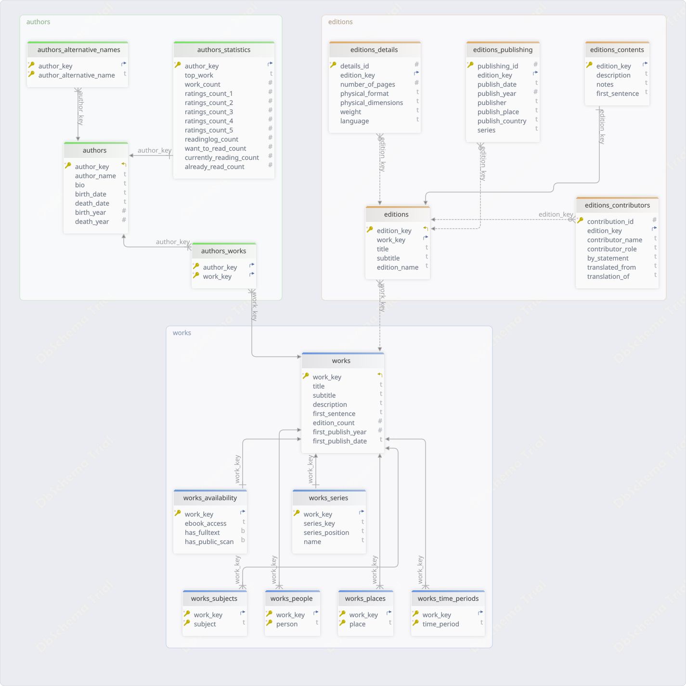

# OpenLibrary ETL Pipeline

An end-to-end ETL pipeline that extracts data from the Open Library API, transforms it into structured datasets, and loads it into a relational database using a schema-driven design.

## Table of Contents

<!-- TOC -->
* [OpenLibrary ETL Pipeline](#openlibrary-etl-pipeline)
  * [Table of Contents](#table-of-contents)
  * [Overview](#overview)
    * [Pipeline Steps](#pipeline-steps)
    * [Project Structure](#project-structure)
  * [Tools](#tools)
    * [Requirements](#requirements)
  * [How to Run](#how-to-run)
  * [Data](#data)
    * [Source](#source)
    * [Output](#output)
    * [Database Schema](#database-schema)
    * [Cardinality](#cardinality)
<!-- TOC -->

## Overview

What the project is trying to achieve:

- Extract structured romance fiction data from OpenLibrary API endpoints
- Build a relational data model for general works, authors, editions and series
- Clean and transform raw JSON into normalized tables
- Load processed data into a PostgreSQL database
- Ensure reproducibility and modular ETL design

### Pipeline Steps

1. `Extract`: fetch data from OpenLibrary API and store raw JSON in `data/romance_fiction/raw/`
2. `Transform`: normalize nested JSON and apply validation rules in order to generate structured tables in `data/romance_fiction/staging/`
3. `Load`: create PostgreSQL database and create tables from SQL schema files in order to load processed CSVs into database `romance_fiction`

### Project Structure
    etl/
    database/
    data/
    utilities/
    config/
    main.py

## Tools
    
The following tools were used for the implementation of this project:

    OpenLibrary API
    Python
    Pandas
    PostgreSQL

### Requirements

    greenlet==3.3.2
    numpy==2.4.4
    pandas==3.0.2
    PyMySQL==1.1.2
    python-dateutil==2.9.0.post0
    six==1.17.0
    SQLAlchemy==2.0.48
    typing_extensions==4.15.0
    tzdata==2025.3

## How to Run

In order to run this project only the following command can be used in order to run the pipeline:

    python main.py

## Data

### Source

OpenLibrary API was used for data ingestion.
See [api_documentation.md](https://github.com/EfiLygda/openlibrary-etl-pipeline/blob/Romance_Works/etl/extract/docs/api_documentation.md) for more information on API endpoints.

### Output

The processed tables are located at `data/romance_fiction/processed` and loaded in the database with the following sequence:

| Table                         | Rows | Description                                                                                                                                    |
| ----------------------------- |------| ---------------------------------------------------------------------------------------------------------------------------------------------- |
| **authors**                   | 501  | Core author records including names, biography, birth/death dates, and lifespan information.                                                   |
| **authors_alternative_names** | 2808 | Alternative names, pseudonyms, aliases, pen names, and name variations associated with authors.                                                |
| **authors_statistics**        | 500  | Aggregated author-level statistics including work counts, ratings distribution, reading activity, and most popular work.                       |
| **works**                     | 2000 | Canonical literary works (abstract titles) containing work-level metadata such as title, description, publication history, and edition counts. |
| **authors_works**             | 2091  | Many-to-many relationship linking authors to the works they created or contributed to.                                                         |
| **works_series**              | 82  | Series membership information for works, including series identifier, series name, and position within the series.                             |
| **works_availability**        | 2000  | Availability and access information for works, including ebook access status, public scans, and full-text availability.                        |
| **works_subjects**            | 14034  | Subject classifications and thematic categories assigned to works.                                                                             |
| **works_people**              | 3844  | People, characters, or notable individuals referenced, discussed, or featured in works.                                                        |
| **works_places**              | 1689  | Geographic locations, settings, or places associated with works.                                                                               |
| **works_time_periods**        | 604  | Historical eras, time periods, or chronological settings associated with works.                                                                |
| **editions**                  | 54589  | Specific published editions of works, including edition titles, subtitles, and edition-specific identifiers.                                   |
| **editions_contributors**     | 11288  | Contributors to editions (e.g., translators, editors, illustrators, foreword writers) and their roles.                                         |
| **editions_publishing**       | 59020  | Publication metadata for editions, including publisher, publication date, publication place, country, and series information.                  |
| **editions_contents**         | 9567  | Edition-specific content information such as descriptions, notes, and opening text.                                                            |
| **editions_details**          | 52656  | Physical and bibliographic details of editions, including page count, format, dimensions, weight, and language.                                |

### Database Schema

In the following image the database's diagram is presented, by grouping the 16 tables in 3 groups:

### Cardinality

| Relationship                 | Cardinality                    |
| ---------------------------- | ------------------------------ |
| Author ↔ Work                | Many-to-many (`authors_works`) |
| Work ↔ Edition               | One-to-many                    |
| Work ↔ Subject               | One-to-many                    |
| Work ↔ Person                | One-to-many                    |
| Work ↔ Place                 | One-to-many                    |
| Work ↔ Time Period           | One-to-many                    |
| Work ↔ Availability          | One-to-one                     |
| Work ↔ Series                | Zero-or-one per work           |
| Author ↔ Alternative Names   | One-to-many                    |
| Author ↔ Statistics          | One-to-one                     |
| Edition ↔ Contributors       | One-to-many                    |
| Edition ↔ Publishing Records | One-to-many                    |
| Edition ↔ Contents           | One-to-one                     |
| Edition ↔ Details            | One-to-one                     |

